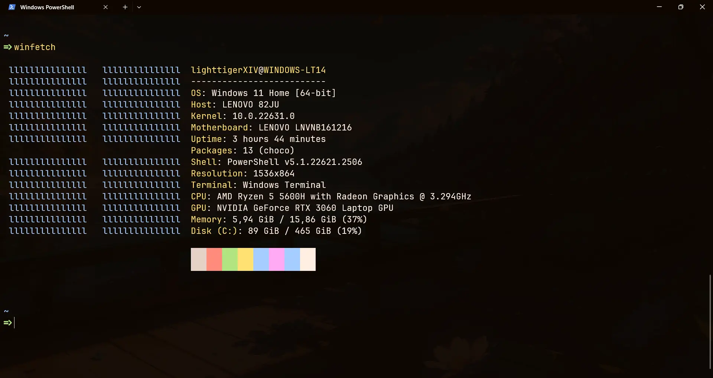
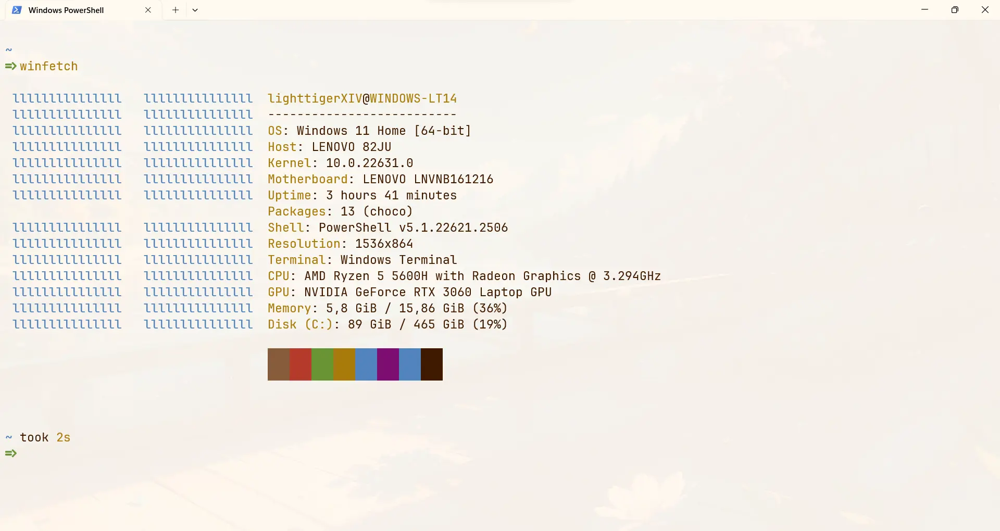

### Whiskers for [Windows Terminal](https://apps.microsoft.com/detail/9n0dx20hk701)

    
    

## 👷‍♂️ Install
### Install the theme
- Open windows terminal settings `ctrl + ,`
- Open the settings json file
- Add [panther](src/panther-scheme.json) or [tiger](src/tiger-scheme.json) scheme(s) in the **schemes** array
- Add [panther](src/panther-theme.json) or [tiger](src/tiger-theme.json) theme(s) in the **themes** array. Create it if it doesn't exist

### Apply the theme
- Go to `Appearance` settings tab and select the whiskers theme
- Go to `Defaults -> Appearance` and select the whiskers color scheme
- Save

## 💻 Maintainers

- [lightttigerXIV](https://github.com/lighttigerxiv)
